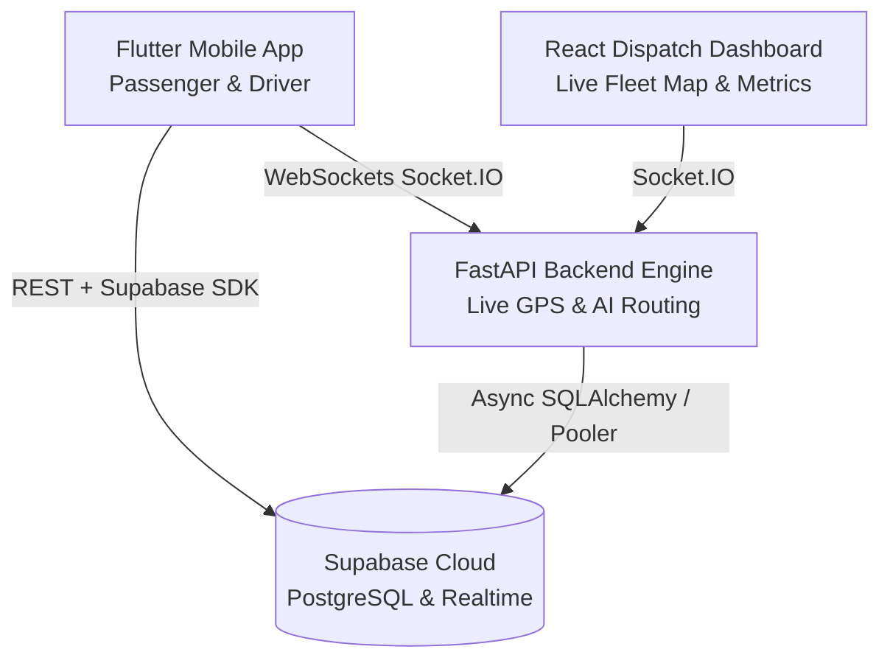

# 🚌 SmartTransit AI Platform 🇧🇼
### Intelligent Multi-Modal Public Transit & AI Mobility Facilitator for Botswana and Southern Africa

SmartTransit is a modern, full-stack transit management, live dispatch, and AI routing platform built for Commuters, Combi & Bus Operators, and Transit Authorities across Botswana (Gaborone, Molepolole, Francistown, Lobatse, Kanye, and Intercity Corridors).

---

## 🌟 System Architecture



---

## 📦 Components

1. **`smart_transit_app/` (Flutter Cross-Platform Mobile App)**:
   - Commuter hailing (Combi, Bus, Special Taxi).
   - Driver shift management & live GPS broadcasting.
   - AI Multi-Modal Journey Planner with dynamic transfers and fare calculation.
   - Built-in Supabase Cloud query fallback: functions everywhere on 4G/5G/Wi-Fi.

2. **`backend/` (FastAPI + Socket.IO Real-Time Engine)**:
   - Live bidirectional dispatch & fleet clustering.
   - Intelligent spacing advisory (Headway management to prevent vehicle bunching).
   - Multi-modal graph-based route & transfer optimizer (Dijkstra algorithm).
   - Resilient database engine connecting to Supabase Cloud PostgreSQL.

3. **`dashboard/` (React + Vite Real-Time Dispatch Command Center)**:
   - Live Botswana map tracking all active drivers, combis, and commuter hails.
   - Fleet capacity metrics and passenger demand charts.
   - Emergency transit advisory broadcasting.

4. **`supabase/` (Cloud Database, Schemas, Migrations & Edge Functions)**:
   - Complete PostgreSQL schema (`routes`, `stops`, `trips`, `hails`, `driver_locations`, `users`).
   - Row Level Security (RLS) policies allowing public read & mobile ride requests.
   - Deno Edge Functions for serverless routing and journey planning.

---

## 🚀 Quick Start Guide

### 1. Supabase Database Setup
1. Open your Supabase project: [https://supabase.com/dashboard/project/xpphmiajwjkcxtxitcex](https://supabase.com/dashboard/project/xpphmiajwjkcxtxitcex)
2. Go to **SQL Editor** -> **New Query**.
3. Paste the contents of `backend/schema_supabase.sql` and run.
4. All tables, RLS policies, realtime publications, and Botswana routes/stops will be initialized.

### 2. Running the Backend Server
```bash
cd backend
python -m venv .venv
source .venv/bin/activate  # Or on Windows: .\.venv\Scripts\activate
pip install -r requirements.txt
python main.py
```
Backend API will be live at: `http://localhost:8000` (Docs at `http://localhost:8000/docs`).

### 3. Running the Dispatch Dashboard
```bash
cd dashboard
npm install
npm run dev
```
Dashboard will open at: `http://localhost:5173`.

### 4. Running the Flutter Mobile App
```bash
cd smart_transit_app
flutter pub get
flutter run
```

---

## 🌐 Cloud Hosting & Global Access

The backend is cloud-ready and can be deployed anywhere with 1 click:
- **Render.com**: Connect this repository; Render uses the included `render.yaml`.
- **Railway.app**: Connect this repository; Railway uses the included `railway.json`.
- **Docker**: Build and run with `docker build -t smarttransit-backend backend/` and `docker run -p 8000:8000 smarttransit-backend`.

For complete deployment details, see [`backend/deploy_guide.md`](file:///c:/Users/araba/Desktop/SmartTransit/backend/deploy_guide.md).

---

## 📚 Academic Research & Project Documentation

Comprehensive academic technical documentation prepared for the University Assessment Schedule is cataloged in the [`docs/`](file:///c:/Users/araba/Desktop/SmartTransit/docs) directory:
- **[Project Milestone Tracker & Assessment Schedule](file:///c:/Users/araba/Desktop/SmartTransit/docs/project_milestone_tracker_and_schedule.md)**: Master schedule and living progress tracker aligned with university deliverable deadlines (Phase 1 through Phase 7, 14 Aug to 17 Nov 2026), role distribution, and weekly milestone sign-offs.
- **[Technical Methodology, System Algorithms & Literature Review Guide](file:///c:/Users/araba/Desktop/SmartTransit/docs/technical_methodology_and_literature_review_guide.md)**: Master reference document for **Project Review 1 (Deadline: 7 September 2026)**. Contains mathematical formulations, code mappings, justification, and seminal academic citations (Haversine, $k$-NN dispatch, Daganzo/Newell headway regularization, Lin et al. ETA speed flooring, NetworkX multi-modal backward scheduling, Cervero paratransit tariffs), along with WBS and requirement catalogue.
- **[Research Questionnaires & UAT Instruments](file:///c:/Users/araba/Desktop/SmartTransit/docs/research_questionnaires_and_uat_instruments.md)**: Academic ethics clearance forms, commuter/driver baseline surveys, and field User Acceptance Testing instruments.


---

## 📄 License
MIT License. Developed for Botswana's public transportation network.
